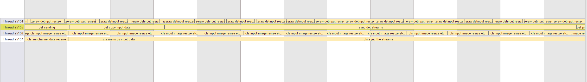
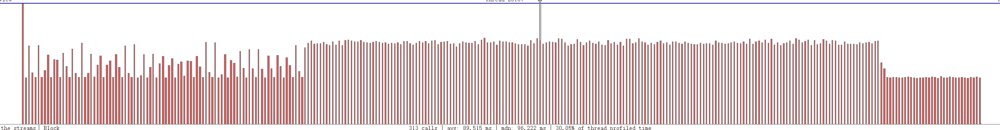

## Table of Content
- [Table of Content](#table-of-content)
- [Directory Structure](#directory-structure)
- [Introduction](#introduction)
- [Performances](#performances)
- [Build and Run](#build-and-run)
- [Note](#note)


## Directory Structure

``` bash
|-- doc # image for README
|-- CMakeLists.txt # The CMake file.
|-- README.md # The readme file..
|-- chan.hpp # A simple thread communication tool.
|-- sampleParallelPipeline.cpp # The main code.
```

## Introduction

This example demonstrates how to perform inference on two models in parallel in GCU. You can refer to another example (`sampleSimpleSerialPipeline`) to see how the serial method works.

To run this example, you need to download two models, `resnet50` and `yolov5s`, from the modezoo of GCU.

This example constructs a simple architecture that allows two models to run in parallel:

`yolov5s` continuously `detects` bounding boxes from the image and sends them to a queue. 

`resnet50` obtains the corresponding image area of the bounding box from the queue and then performs `recognition`. In other words, `detection` and `recognition` are running in parallel.

Specifically, this example implements a semantic similar to the `chan` in the `Go language`, allowing two threads to use this `channel` for data transmission (`chan.hpp`).

## Performances

This example provides an [easy profiler](https://github.com/yse/easy_profiler) approach to evaluate the performance of parallel running. You can install the relevant dependencies and enable the `PROFILE` macro definition in the building stage.

After successfully compiling and running, a `result.prof` file will be generated. By opening it with the easy profiler tool, we can see a timeline graph as below: 



Our main focus is on whether the inferences are scheduled tightly enough. The following shows the call density of `detection` and `recognition` respectively. The denser the bar chart block, the better the performance:





## Build and Run
You can build this example using cmake:
``` bash

mkdir build && cd build && cmake ../

```

Alternatively, you can just use a long compiling command such as:

``` bash

g++  -I/usr/include/TopsInference  -Wall  -O3 -Werror -Wno-sign-compare -std=c++17 -L/usr/lib -L/usr/local/lib/ -lTopsInference -lpthread -ldl -Wl,-fuse-ld=gold -o ./sampleParallelPipeline sampleParallelPipeline.cpp

```

The complete example runs as follows:

``` bash
## Install Topsinference & TopsSDK (If you already installed, just jump this step)
dpkg -i <SDKPATH>/framework/tops-inference_<version>_<arch>_internal.deb 
dpkg -i <SDKPATH>/sdk/tops-sdk_<version>_<arch>_internal.deb 

#build:
mkdir build && cd build && cmake ../

# Usage: sampleParallelPipeline [options...]
# Options:
#     --det_vg               number of VG (detection model) 
#     --det_buffersize       buffer size (detection model) 
#     --det_nstream          number of streams (detection model) 
#     --det_modelpath        onnx model path (detection model) 
#     --det_inputname        onnx model input name (detection model) 
#     --det_shape            input shape (detection model) 
#     --cls_vg               number of VG (classification model) 
#     --cls_buffersize       buffer size (classification model) 
#     --cls_nstream          number of streams (classification model) 
#     --cls_modelpath        onnx model path (classification model) 
#     --cls_inputname        onnx model input name (classification model) 
#     --cls_shape            input shape (classification model) 
#     --imagepath            input image path       
#     --image_shape          input image shape      
#     --loop                 number of running loop 
#     -h, --help             Shows this page         (Optional)

#gen input.data
python3.6 gendata.py

#test:
./sampleParallelPipeline \
--det_vg=2 \
--det_buffersize=32 \
--det_nstream=1 \
--det_modelpath=./yolov5s-v6.0-640-op13-fp32-N.onnx \
--det_inputname=images \
--det_shape=1,3,640,640 \
--cls_vg=4 \
--cls_buffersize=512 \
--cls_nstream=1 \
--cls_modelpath=./resnet50-v1.5-op13-fp32-N.onnx \
--cls_inputname=input \
--cls_shape=1,3,224,224 \
--imagepath=./input.data \
--loop=10000 \
--image_shape=1,3,1080,810

#will printing like this：
# ....
# >>>>>>>>>img: 9997   box : [3.11451, 211.71, 798.957, 790.45, 0.940344, 5], 575
# >>>>>>>>>img: 9997   box : [659.922, 625.505, 690.233, 715.509, 0.807789, 41], 881
# >>>>>>>>>img: 9998   box : [56.6898, 404.448, 219.401, 904.455, 0.996933, 0], 796
# >>>>>>>>>img: 9998   box : [670.511, 405.385, 808.846, 884.635, 0.985094, 0], 792
# >>>>>>>>>img: 9998   box : [226.464, 401.69, 343.154, 860.978, 0.981963, 0], 148
# >>>>>>>>>img: 9998   box : [-0.0180397, 557.767, 66.6281, 872.934, 0.981138, 0], 881
# >>>>>>>>>img: 9998   box : [3.11451, 211.71, 798.957, 790.45, 0.940344, 5], 575
# >>>>>>>>>img: 9998   box : [659.922, 625.505, 690.233, 715.509, 0.807789, 41], 881
# >>>>>>>>>img: 9999   box : [56.6898, 404.448, 219.401, 904.455, 0.996933, 0], 796
# >>>>>>>>>img: 9999   box : [670.511, 405.385, 808.846, 884.635, 0.985094, 0], 792
# >>>>>>>>>img: 9999   box : [226.464, 401.69, 343.154, 860.978, 0.981963, 0], 148
# >>>>>>>>>img: 9999   box : [-0.0180397, 557.767, 66.6281, 872.934, 0.981138, 0], 881
# >>>>>>>>>img: 9999   box : [3.11451, 211.71, 798.957, 790.45, 0.940344, 5], 575
# >>>>>>>>>img: 9999   box : [659.922, 625.505, 690.233, 715.509, 0.807789, 41], 88
# [INFO] running time: 51 seconds

```

## Note
The allocation of `vg` is sensitive, because the differential average inference time between the two models has a gap. 

The input `shape` parameter, such as `--det_shape`, must meet the definition of the model file `--cls_modelpath`. In addition, the `buffersize` parameter ensures that it does not exceed the memory limit of GCU. Please refer to the relevant GCU documentation for specific values.